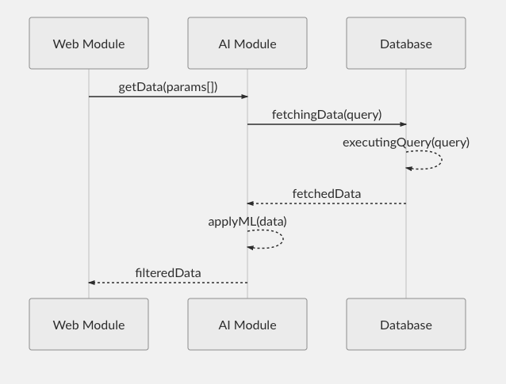

# Agora

A repository made to track the development of Agora Web Module.

## Requirements

These requirements are essential to install and run Web Module application.

1.  [Git](https://git-scm.com/)
2.  [PHP](https://www.php.net/)
3.  [CakePHP](https://cakephp.org/)
4.  [Composer](https://getcomposer.org/)
5.  [MySQL](https://www.mysql.com/)

## How does it work?

Agora is based on a continuous communication between two modules:

- Web Module
- AI Module

#### Communication




## Installation

The repository is really fast and easy to setup. Follow the instructions:

#### Clone the repository

To clone the repository and move your working directory inside it , run the commands:

```bash
git clone https://github.com/DanjelDelishi/epebook_Creazione-Agora-AI-.git

cd epebook_Creazione-Agora-AI-
```

#### Install vendors

To install the plugins and the vendors required, run the command:

```bash
composer install
```

This command will install all the plugins reported by the dependencies in the file `composer.json`.

#### Create database

To create the database for Agora, run the sql file `config/schema/app.sql`.

## Configuration

Read and edit `config/app.php` and setup the `'Datasources'` and any other
configuration relevant for your application.

## Run

You can now either use your machine's webserver to view the default home page, or start
up the built-in webserver with:

```bash
bin/cake server -p 8765
```

Then visit `http://localhost:8765` to see the welcome page.